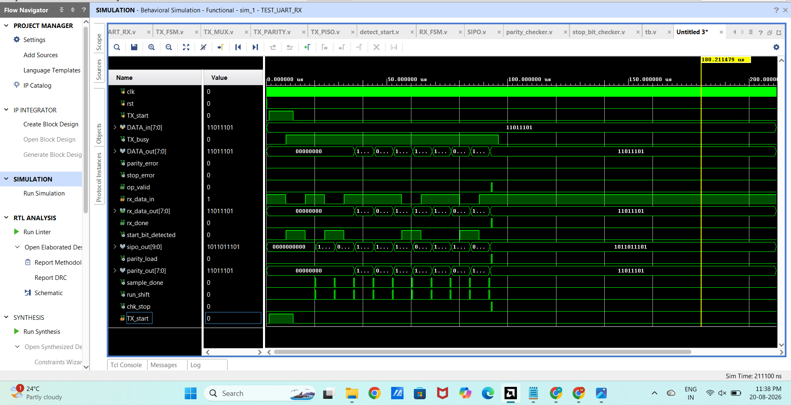
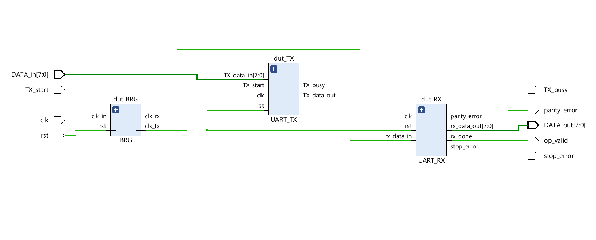

# UART Protocol Design & Verification using Verilog HDL

A modular UART communication design implemented using **Verilog HDL** and functionally verified using **Xilinx Vivado**.

## Project Overview

This project implements a UART transmitter and receiver using modular RTL design. The top-level design connects the UART transmitter output directly to the UART receiver input, creating an internal **TX-to-RX loopback** for functional verification.

The design includes baud-rate generation, transmitter and receiver control FSMs, serial/parallel data conversion, parity checking, stop-bit validation, and data-valid signaling.

This project was developed as a personal learning project following a hands-on RTL/FPGA workshop.

## Architecture

The top-level UART consists of three main components:

```text
                    ┌─────────────────┐
                    │      BRG        │
                    │ Baud Generation │
                    └───────┬─────────┘
                            │
                  ┌─────────┴─────────┐
                  │                   │
                clk_tx              clk_rx
                  │                   │
                  ▼                   ▼
        ┌─────────────────┐   ┌─────────────────┐
        │    UART_TX      │   │    UART_RX      │
        │                 │   │                 │
DATA_in ─► TX Processing  │   │  RX Processing  │
        │                 │   │                 │
        └───────┬─────────┘   └───────▲─────────┘
                │                     │
                │   Serial Loopback   │
                └─────────────────────┘
                         │
                         ▼
                    DATA_out[7:0]
```

## Main Features

* Modular UART transmitter and receiver
* Internal TX-to-RX loopback
* Baud-rate/clock generation
* FSM-based TX control
* FSM-based RX control
* Parallel-to-serial conversion
* Serial-to-parallel conversion
* Start-bit detection
* Parity generation and checking
* Stop-bit validation
* TX busy indication
* RX data-valid indication
* Parity error detection
* Stop-bit error detection

## RTL Modules

| Module               | Function                                         |
| -------------------- | ------------------------------------------------ |
| `UART.v`             | Top-level UART integration and TX-to-RX loopback |
| `BRG.v`              | Baud-rate/clock generation                       |
| `UART_TX.v`          | UART transmitter                                 |
| `UART_RX.v`          | UART receiver                                    |
| `TX_FSM.v`           | Transmitter control FSM                          |
| `TX_MUX.v`           | TX data/control selection                        |
| `TX_PARITY.v`        | TX parity generation                             |
| `TX_PISO.v`          | Parallel-to-serial conversion                    |
| `RX_FSM.v`           | Receiver control FSM                             |
| `SIPO.v`             | Serial-to-parallel conversion                    |
| `detect_start.v`     | Start-bit detection                              |
| `parity_checker.v`   | Parity verification                              |
| `stop_bit_checker.v` | Stop-bit validation                              |

## Baud-Rate Generation

The `BRG` module generates separate timing signals for the transmitter and receiver.

The current implementation uses:

```verilog
parameter n = 50;
```

The RX timing signal is generated from the input clock using the configured divider, while the TX timing signal is generated from the RX clock using an additional divider.

This clock-generation approach provides the timing required by the TX and RX logic in the current simulation design.

## Data Flow

The top-level data flow is:

```text
DATA_in[7:0]
      │
      ▼
   UART_TX
      │
      │ tx_data_out
      ▼
   UART_RX
      │
      ▼
DATA_out[7:0]
```

The transmitted serial data is internally routed back into the receiver, allowing the transmitted byte to be received and verified without requiring an external UART device.

## Verification

The design was functionally verified using **Xilinx Vivado Behavioral Simulation**.

The testbench exercises the UART TX/RX path and observes signals including:

* `TX_start`
* `TX_busy`
* `DATA_in[7:0]`
* `rx_data_in`
* `rx_data_out[7:0]`
* `rx_done`
* `parity_error`
* `stop_error`
* `start_bit_detected`
* `sample_done`
* `run_shift`
* `chk_stop`

The simulation waveform demonstrates serial transmission, reception, data shifting, parity checking, stop-bit checking, and generation of the received-data-valid signal.

## Simulation Waveform



## Block Diagram



## Tools & Technologies

* Verilog HDL
* Xilinx Vivado
* RTL Design
* Digital Logic Design
* Finite State Machines
* UART / Serial Communication
* Behavioral Simulation

## Repository Structure

```text
uart-protocol-verilog/
│
├── README.md
│
├── rtl/
│   ├── UART.v
│   ├── BRG.v
│   ├── UART_RX.v
│   ├── TX_FSM.v
│   ├── TX_MUX.v
│   ├── TX_PARITY.v
│   ├── TX_PISO.v
│   ├── RX_FSM.v
│   ├── SIPO.v
│   ├── detect_start.v
│   ├── parity_checker.v
│   └── stop_bit_checker.v
│
├── testbench/
│   └── tb.v
│
└── docs/
    ├── uart_block_diagram.png
    └── uart_simulation.png
```

## Project Highlights

* Designed a modular UART TX/RX architecture in Verilog HDL.
* Implemented an internal TX-to-RX loopback for functional verification.
* Developed separate FSM-based control logic for transmission and reception.
* Implemented parity and stop-bit error detection.
* Designed a configurable clock-generation module using a parameterized divider.
* Verified the design through behavioral simulation in Xilinx Vivado.

## Future Improvements

* Add external TX and RX ports for communication with an external UART device.
* Add configurable baud-rate selection.
* Add configurable parity modes.
* Add configurable data width.
* Perform FPGA hardware validation.
* Develop a more comprehensive automated verification environment.

## Author

**Mansi**

Verilog HDL | RTL Design | FPGA | Digital Design
